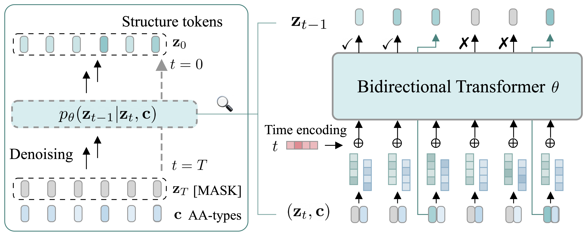

<div align="center">

# Structure Language Models for Protein Conformation Generaton (ICLR'25)

<a href="https://pytorch.org/get-started/locally/"></a>
<a href="https://pytorchlightning.ai/"></a>
<a href="https://hydra.cc/"></a>
<a href="https://github.com/ashleve/lightning-hydra-template"></a><br>
[](https://arxiv.org/abs/2410.18403)
[](https://openreview.net/forum?id=OzUNDnpQyd)
[](https://iclr.cc/Conferences/2025)

</div>


## 📜 Description

<p align="center">

</p>


**Structure Language Models (SLM)** is an SE(3)-invariant learning framework designed for efficient protein conformation generation. It encodes protein structures into a compact, discrete latent space using a discrete variational auto-encoder. Following encoding, SLM employs conditional language modeling to effectively capture sequence-specific conformational distributions.

Among various language modeling approaches, we introduce **ESMDiff** ([ESM3](https://www.science.org/doi/10.1126/science.ads0018) enhanced with mask diffusion fine-tuning), establishing it as a state-of-the-art discrete diffusion implementation within the SLM framework.

Our open-source codebase provides a effective fine-tuning pipeline to adapt these foundational protein language models to task-specific applications (such as conformation generation).

<p align="center">

</p>


## 🚀 Installation
```bash
conda create -n py310 python=3.10 -y
conda activate py310
pip install -r requirements.txt
pip install -e .    # install locally 
```

Configure ESM3-open and Download weights:

> In order to download the weights, we require users to accept our non-commercial license.
> The weights are stored on HuggingFace Hub under [HuggingFace/EvolutionaryScale/esm3](https://huggingface.co/EvolutionaryScale/esm3).
> Please create an account and accept the license.

```py
from huggingface_hub import login
from esm.models.esm3 import ESM3
from esm.sdk.api import ESM3InferenceClient, ESMProtein, GenerationConfig

# Will instruct you how to get an API key from huggingface hub, make one with "Read" permission.
login()
```


## ▶️ Inference
We open-source the ESMDiff checkpoint via Google Drive [here](https://drive.google.com/file/d/1p99hxxfgIlLlO1i0CP-P34Rjnegkcb_L/view?usp=sharing). You may download the file and place them under `data/ckpt`. 

Sample from ESMDiff (masked diffusion fine-tuned ESM3). We provide two examples here:
```bash
# iterative sampling using fine-tuned ESMDiff, 25 steps and 100 samples
python slm/sample_esmdiff.py --input data/targets/bpti --output outputs/inference_esmdiff --num_steps 25 --num_samples 100 --ckpt data/ckpt/release_v0.pt
# inpainting using pre-trained ESM3
python slm/sample_esmdiff.py --input data/targets/bpti --output outputs/inference_esmdiff --num_steps 25 --num_samples 100 --mask_ids 1,2,3,4,5
```
🤗 Explore more configurations in `slm/sample_esmdiff.py`.


## 📂 Data Processing
Optionally, download and preprocess the PDB database:
```bash
# to download the whole pdb database
python scripts/download_pdb_mmcif.sh ./pdb_mmcif 

# ad hoc: biopython=1.79 is required for mmcif_parsing
pip install biopython==1.79
python scripts/pdb/preprocess.py --mmcif_dir pdb_data/pdb_mmcif --output_dir pdb_data/processed_chains --per_chain --strip_array

# turn back to this version for main usage
pip install biopython==1.84 
```

Compute VQ-VAE encodings for training:
```bash
# turn processed pickle (above) or pdb files into 
python scripts/dump.py pdb_data/processed_chains pdb_data/processed_chains_encoding pkl
# if you have some dataset of pdb files at hand
python scripts/dump.py pdb_data/raw_pdb pdb_data/raw_pdb_encoding pdb
```

## 🧑‍💻 Training
```bash
# test case: training pipeline (only 5 training examples)
bash train.sh experiment=mdlm paths.data_dir=data/dummy_train_data data.batch_size=1 logger=csv trainer.devices=1 data.train_val_split=[0.8,0.2]

# standard jobs
sbatch train.sh experiment=jlm paths.data_dir=pdb_data/raw_pdb_encoding data.batch_size=16 logger=csv 
sbatch train.sh experiment=clm paths.data_dir=pdb_data/raw_pdb_encoding data.batch_size=16 logger=csv 
sbatch train.sh experiment=mdlm paths.data_dir=pdb_data/raw_pdb_encoding data.batch_size=16 logger=csv 
```

## 📊 Evaluation 
See `./analysis`.


## 📄 LICENSE
The source code and model can be used for non-commerical purpose. For any components related to ESM3, please strictly follow the volutionaryScale Cambrian Non-Commercial License Agreement <https://www.evolutionaryscale.ai/policies/cambrian-non-commercial-license-agreement>. 


## 📝 Citation
If you find this codebase inspiring in your research, please cite the following paper. 🥰

```
@inproceedings{
    lu2025structure,
    title={Structure Language Models for Protein Conformation Generation},
    author={Jiarui Lu and Xiaoyin Chen and Stephen Zhewen Lu and Chence Shi and Hongyu Guo and Yoshua Bengio and Jian Tang},
    booktitle={The Thirteenth International Conference on Learning Representations},
    year={2025},
    url={https://openreview.net/forum?id=OzUNDnpQyd}
}
```
